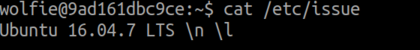
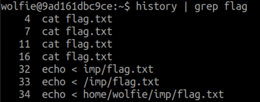
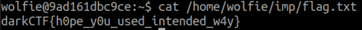

# linux starter

## Problem description

Don't Try to break this jail

ssh wolfie@linuxstarter.darkarmy.xyz -p 8001 password : wolfie

## Solving the challenge

Connected to the server through ssh.

The problem is that many of the bash commands will not execute, since we are running
within a restricted shell. In this case, I tried different commands until I found the ones that worked for solving the challenge.

Found the OS:



Checked current working directory:


Since it is Ubuntu 16.04, thought I would take a quick look at the .bashrc and .profile configuration files:
```
wolfie@9ad161dbc9ce:~$ cat .bashrc .profile
# ~/.bashrc: executed by bash(1) for non-login shells.
# see /usr/share/doc/bash/examples/startup-files (in the package bash-doc)
# for examples

# If not running interactively, don't do anything
case $- in
    *i*) ;;
      *) return;;
esac

# don't put duplicate lines or lines starting with space in the history.
# See bash(1) for more options
HISTCONTROL=ignoreboth

(...)
```

Didn't find any interesting configuration, just the default, but the `HISTCONTROL` parameter in `.bashrc` made me think that maybe we can find something interesting
using the `history` command:



Turns out that `/home/wolfie/imp/flag.txt` contains the flag:


